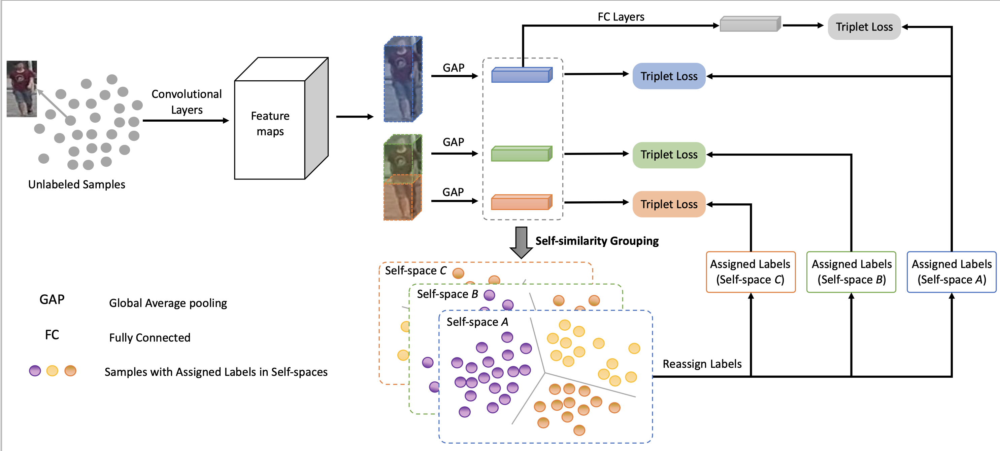

# Self-similarity Grouping: A Simple Unsupervised Cross Domain Adaptation Approach for Person Re-identificatio(SSG)
Implementation of the paper [Self-similarity Grouping: A Simple Unsupervised Cross Domain Adaptation Approach for Person Re-identificatio](https://arxiv.org/abs/1807.11334), ICCV 2019 (Oral)


The SSG approach proposed in the paper is simple yet effective and achieves the state-of-arts on three re-ID datasets: Market1501, DukdMTMC and MSMT.



<!-- ## Setup

1. Datasets (source dataset and target dataset).
2. Pre-trained (on source dataset) model.

## Requirements

- PyTorch -->

## Running the experiments

### Step 1: Train on source dataset

Run `source_train.py` via

```shell
python source_train.py \
    --dataset <name_of_source_dataset>\
    --resume <dir_of_source_trained_model>\
    --data_dir <dir_of_source_data>\
    --logs_dir <dir_to_save_source_trained_model>
```

To replicate the results in the paper, you can download pre-trained models on Market1501 from [GoogleDrive](https://drive.google.com/open?id=1xNqduSroUMDbM_E5VeeR1WuykMh8Oxlb) and on DukeMTMC from [GoogleDrive](https://drive.google.com/file/d/1CFuf_vF9OphbuCyMefa3W8GA8tgcvSkI/view?usp=sharing). Our models are trained with __PyTorch 0.4.1__ or __PyTorch 1.0__.

### Step 2: Run Self-similarity Grouping

```shell
python selftraining.py \
    --src_dataset <name_of_source_dataset>\
    --tgt_dataset <name_of_target_dataset>\
    --resume <dir_of_source_trained_model>\
    --iteration <number of iteration>\
    --data_dir <dir_of_source_target_data>\
    --logs_dir <dir_to_save_model_after_adaptation>\
    --gpu-devices <gpu ids>\
    --num-split <number of split>
```
Or just command
```shell
./run.sh
```
### Step 3: Run Clustering-guided Semi-Supervised Training
```shell
python semitraining.py \
    --src_dataset <name_of_source_dataset>\
    --tgt_dataset <name_of_target_dataset>\
    --resume <dir_of_source_trained_model>\
    --iteration <number of iteration>\
    --data_dir <dir_of_source_target_data>\
    --logs_dir <dir_to_save_model_after_adaptation>\
    --gpu-devices <gpu ids>\
    --num-split <number of split>\
    --sample <sample method>
```

## Results

### Step 1: After training on source dataset

| Source Dataset | Rank-1 | mAP |
| :--- | :---: | :---: |
| DukeMTMC | 80.8 | 65.4 |
| Market1501 | 91.6 | 78.2 |
| CUHK03 | 48.79 | 46.95 |
| MSMT17 | 69.82| 42.48 |

### Step 2: After adaptation

<!-- markdownlint-disable MD033 -->
<table>
    <tr>
        <th rowspan="2">SRC --&gt; TGT</th>
        <th colspan="2">Before Adaptation</th>
        <th colspan="2">After Adaptation</th>
        <th rowspan="2">Settings</th>
    </tr>
    <tr>
        <td>Rank-1</td>
        <td>mAP</td>
        <td>Rank-1</td>
        <td>mAP</td>
    </tr>
    <tr><td>CUHK --&gt; Market</td><td>43.26</td><td>19.95</td><td>77.14</td><td>56.60</td><td>default</td></tr>
    <tr><td>CUHK --&gt; DUKE</td><td>19.52</td><td>8.74</td><td>62.48</td><td>42.26</td><td>default</td></tr>
    <tr><td>CUHK --&gt; MSMT</td><td>8.64</td><td>2.49</td><td>29.57</td><td>11.28</td><td>4GPU</td></tr>
    <tr><td>Market --&gt; DUKE</td><td>27.3</td><td>11.9</td><td>68.4</td><td>49.0</td><td>default</td></tr>
    <tr><td>Market --&gt; CUHK</td><td>4.07</td><td>4.53</td><td>20.32</td><td>20.85</td><td>default</td></tr>
    <tr><td>Market --&gt; MSMT</td><td>8.37</td><td>2.54</td><td>30.54</td><td>12.04</td><td>4GPU, num_instances=8</td></tr>
    <tr><td>DUKE --&gt; Market</td><td>46.8</td><td>19.1</td><td>75.8</td><td>53.7</td><td>default</td></tr>
    <tr><td>DUKE --&gt; CUHK</td><td>4.43</td><td>4.56</td><td>9.89</td><td>10.32</td><td>default</td></tr>
    <tr><td>DUKE --&gt; MSMT</td><td>12.38</td><td>3.82</td><td>39.22</td><td>15.99</td><td>4GPU, num_instances=8</td></tr>
    <tr><td>MSMT --&gt; Market</td><td>49.47</td><td>23.71</td><td>80.94</td><td>59.97</td><td>4GPU</td></tr>
    <tr><td>MSMT --&gt; DUKE</td><td>46.54</td><td>27.01</td><td>74.96</td><td>57.05</td><td>4GPU</td></tr>
    <tr><td>MSMT --&gt; CUHK</td><td>10.71</td><td>11.59</td><td>16.21</td><td>16.56</td><td>4GPU</td></tr>
</table>

## FAQ

If you found difficulty in reproducing our reported results, please check the number of GPUs in your experiments. This may be caused by the un-sync BN layer implementation of PyTorch. Below we provide some training logs with the setting Duke --> Market, for helping you check your experiment settings.

### With 2 GPU

| Job ID | 24306 | 24307 | 24308 | 24309| 24310 |24311|
| --- | :---: | :---: | :---: | :---: | :---: | :---: |
|Rank 1| 75.1|75.7|77.5|76.1|77.5|77.3|

[OneDrive Download Link](https://1drv.ms/u/s!AqzBcxT1FhwGjmrOVqAc80h3STAN)

## Acknowledgement

Our code is based on [open-reid](https://github.com/Cysu/open-reid).

